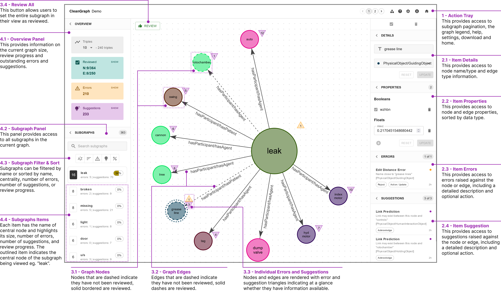

# CleanGraph: Human-in-the-loop Knowledge Graph Refinement and Completion

CleanGraph is designed to address the formidable challenge of correcting errors in knowledge graphs constructed from textual data—a task that often proves difficult using conventional tools like spreadsheet software or even specialised graph database software such as Neo4J.

## Overview

    
    
CleanGraph User Interface - Quick Reference Guide

CleanGraph emerges as a solution by providing a robust, open-source, full-stack platform tailored for the efficient management of knowledge graphs, particularly those composed of semantic triples extracted from text.

It combines intuitive graph visualisation capabilities with comprehensive management features, including knowledge graph refinement and completion plugins. The frontend is built with React.js, offering a seamless, user-friendly experience with a responsive interface, while the backend relies on FastAPI—a cutting-edge, high-performance Python web framework—to ensure rapid and reliable performance. For data storage, CleanGraph employs MongoDB, a NoSQL, document-based database system.

_Please note: CleanGraph is specifically tailored for creating, reading, updating, and deleting graph elements, and does not provide support for complex graph querying functionalities._

## Features

- **Intuitive Interface**: CleanGraph provides an easy-to-use graphical interface that lets users create, edit, review, and manage graphs with ease.
- **Multi-Platform**: Works on any system that supports Python and Node.js, including Windows, macOS, and Linux. Works best in Google Chrome browser.

## Documentation

- [Getting Started](./docs/docs/getting_started.md)
- [Interface](./docs/docs/interface.md)
- [User Guide](./docs/docs/user_guide.md)
- [Plugins](./docs/docs/plugins.md)
- [Tutorial (coming soon!)](./docs/docs/tutorial.md)
- [Contact](./docs/docs/contact.md)

## Contributing

Interested in contributing to CleanGraph? Check out the [Contributing to CleanGraph guide](CONTRIBUTING.md) for guidelines about how to proceed.

## License

CleanGraph is licensed under the terms of the MIT License. See [LICENSE](LICENSE.md) for more details.

## Miscellaneous

- 🎥 Watch a [short video demonstration](https://youtu.be/zhf8XsV8cEg) of CleanGraph.

- :construction: This project/documentation is currently under active development and may be subject to change. Contributions and issue reporting are welcome.
