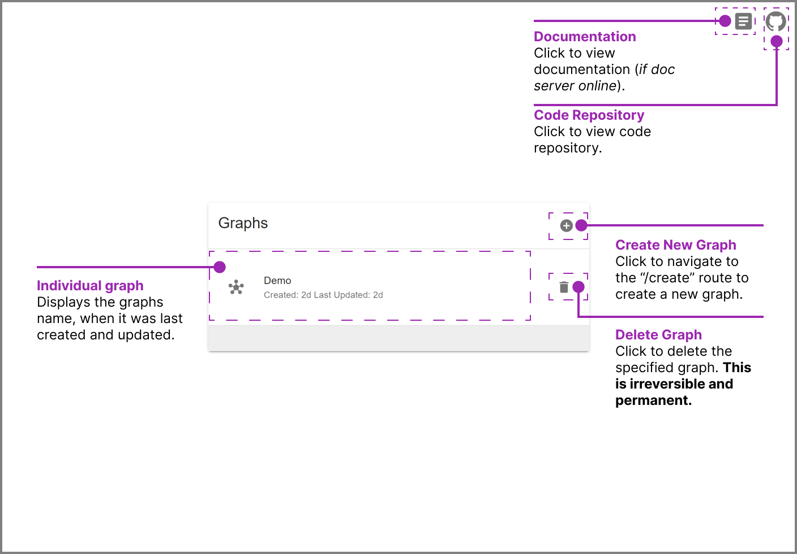
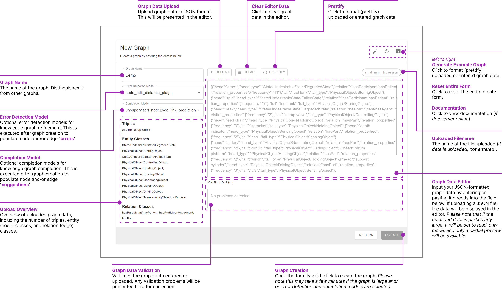

# CleanGraph Interface

## Home

The **Home** page contains all the graphs you've created.

    
    
Figure 1: CleanGraph Home Page UI

## Create

The **Create** page is where new graphs are created.

    
    
Figure 2: CleanGraph Graph Creation Page UI

## Graph Interface

The **Graph Interface** page is the main view of CleanGraph where graphs are interacted with.

    
    
Figure 3: CleanGraph Graph Interface UI

