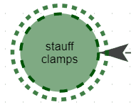
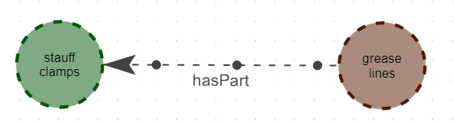
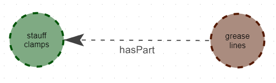
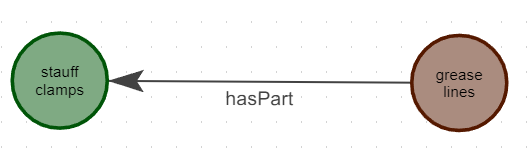

<!-- Please note that if node and edge properties have the key "frequency" which is an integer, it will be used to weight the node/edge. Otherwise, uploading triples with duplicates will result in frequencies being calculated automatically. -->

# User Guide

## Mouse Events / Shortcuts

### Selecting and Unselecting Nodes and Edges

- **Left Click on Node/Edge**:

  - **Select**: Clicking on a graph node or edge will select it. Selected nodes and edges will be highlighted with a rotating halo or particle effect.
  - **Unselect**: Clicking on the selected node or edge again will unselect it, removing the highlighting effect.

- **Left Click on Graph Background Canvas**: Clicking on the blank space within the graph canvas will unselect any currently selected node or edge.

<div style="display: flex; justify-content: center; align-items: center;">
<figure style="text-align: center; margin-right: 20px;">
  
  <figcaption>Selected Node Animation</figcaption>
</figure>

<figure style="text-align: center; margin-left: 20px;">
  
  <figcaption>Selected Edge Animation</figcaption>
</figure>
</div>

### Activation and Deactivation

- **Right Click on Node/Edge**:
  - **Deactivate (If Active)**: Performs a 1-hop deactivation on the node or edge, changing its color to the deactivated color (default red).
  - **Activate (If Deactivated)**: Toggles the node or edge to the active state, reverting it to the standard color.

<figure style="text-align: center">
  
  <figcaption>Activated and deactivated subgraph with 1-hop propagation</figcaption>
</figure>

### Reviewing Nodes and Edges

- **Shift + Left Click on Node/Edge**:
  - **Review**: Toggles the node or edge's reviewed state.
  - **Visual Indication**: Reviewed nodes and edges will be visually distinguished. For example, unreviewed items may have a dashed border (nodes) or dashed edge, while reviewed items will have a solid appearance.

<div style="display: flex; justify-content: center; align-items: center; flex-direction: column;">
<figure style="text-align: center">
  
  <figcaption>Unreviewed subgraph (dashed node border and edge)</figcaption>
</figure>

<figure style="text-align: center">
  
  <figcaption>Reviewed subgraph (solid node border and edge)</figcaption>
</figure>
</div>

## Graph Creation in CleanGraph

You can create a graph in CleanGraph by utilizing the `/create` endpoint. This route allows you to either upload or manually input graph data in JSON format. You may also select optional models for graph refinement and completion at this stage.

### :warning: Caution

- **No Nested Properties**: Properties must be simple key-value pairs, and nested properties are not allowed.
- **Handling Duplicate Nodes**: If duplicate nodes are present in the data, their properties will be merged, and duplicates will be removed.

### Graph Data Formats

CleanGraph currently supports graphs formatted in JSON. Here are the formats that can be used:

#### Simple, Untyped Graph

```json
[
    {
        "head": "string",
        "edge": "string",
        "tail": "string"
    },
    ... // Additional triples
]
```

#### Typed Graph

```json
[
    {
        "head": "string",
        "head_type": "string",
        "edge": "string",
        "tail": "string",
        "tail_type": "string"
    },
    ... // Additional triples
]
```

#### Typed Graph with Properties

```json
[
    {
        "head": "string",
        "head_type": "string",
        "head_properties": {
            // Key-value pairs for head properties
        },
        "edge": "string",
        "edge_properties": {
            // Key-value pairs for edge properties
        },
        "tail": "string",
        "tail_type": "string",
        "tail_properties": {
            // Key-value pairs for tail properties
        }
    },
    ... // Additional triples
]
```

**Note**: In the Typed Graph with Properties format, the head_properties, edge_properties, and tail_properties must be objects containing key-value pairs.

<!-- ## Documentation

## CRUD operations

### Creating an edge

### Creating a node (with a relation)

### Merging subgraphs

Via name change in the sidebar. This increments the frequency of duplicate relations and adds new ones.

Merging subgraphs can be desirable if there are two central nodes that you want to combine into one. For example, `a/c` and `air conditioner` - here the first node is an abbreviation of the latter, however the `a/c` subgraph has facts that may hold for the `air conditioner` subgraph. This action can also be desirable for graphs where the

## Node selection

Selecting a node will dim other nodes and relations.

# Shortcuts

## Select two nodes to add a new edge

- Holding `ctrl` left click on two nodes. This will present you with the option to add an edge. The direction is from the first node to the second node.

# Workflow

Select a subgraph which is centred on a node. Paginate through the graph and review it (make changes etc). After review, click on `reviewed` to set the entire subgraph as correct.
 -->

<!-- ### Add new node/edge classes -->

<!-- ### Update node details (name/type) -->

<!-- ### Update edge details (type/direction) -->

<!-- ### Marking items for deletion -->
